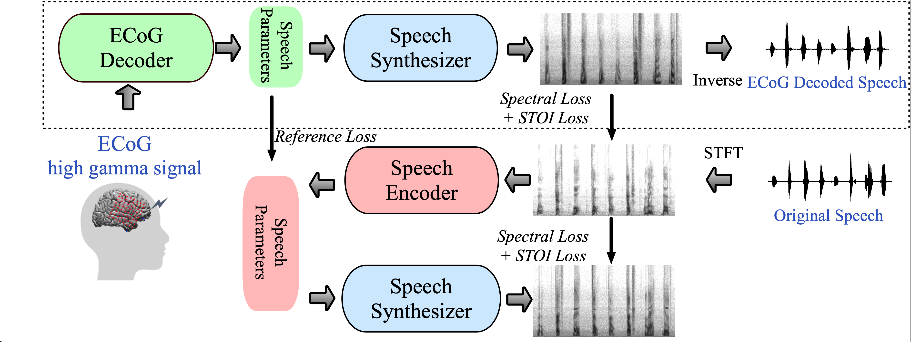

# Neural Speech Decoding

By ...

## Introduction
Our ECoG to Speech decoding framework is initially described in [A Neural Speech Decoding Framework Leveraging Deep Learning and Speech Synthesis](). We present a novel deep learning-based neural speech decoding framework that includes an ECoG Decoder that translates electrocorticographic (ECoG) signals from the cortex into interpretable speech parameters and a novel differentiable Speech Synthesizer that maps speech parameters to spectrograms. We develop a companion audio-to-audio auto-encoder consisting of a Speech Encoder and the same Speech Synthesizer to generate reference speech parameters to facilitate the training of the ECoG Decoder. This framework generates natural-sounding speech and is highly reproducible across a large cohort of participants (n=48). We provide two-stage training **pipeline** with visualization tools.

<div align="center">
    
</div>

## Getting Started

### Installation

- Install `CUDA 11.0` with `cuDNN 8` following the official installation guide of [CUDA](https://docs.nvidia.com/cuda/cuda-installation-guide-linux/index.html) and [cuDNN](https://developer.nvidia.com/rdp/cudnn-archive).

- Setup conda environment:
```bash
conda create -n Neural_Speech python=3.7 -y
conda activate Neural_Speech

# Install requirements
conda install pytorch torchvision torchaudio cudatoolkit=11 -c pytorch -y

# Clone SimMIM
git clone https://github.com/james20141606/neural_speech_decoding
cd neural_speech_decoding

# Install other requirements
pip install -r requirements.txt
```


## Data

Prepare the data in HDF5 format, refer to the [prepare_data](notebooks/prepare_data.ipynb)

Optionally, if you want to provide extra supervision for pitch and formant, please refer to the [formant_pitch_label_extraction](notebooks/formant_pitch_label_extraction.ipynb)

## Training
Fill in the config files including `configs/a2a_production.yaml,configs/e2a_production.yaml,configs/AllSubjectInfo.json,configs/train_param_production.json` following the example of participants `NY869`

## Speech to Speech 

```
usage: train_a2a.py [-h] [-c FILE] [--DENSITY DENSITY] [--wavebased WAVEBASED] [--bgnoise_fromdata BGNOISE_FROMDATA] [--ignore_loading IGNORE_LOADING] [--finetune FINETUNE] [--learnedmask LEARNEDMASK]
[--dynamicfiltershape DYNAMICFILTERSHAPE] [--formant_supervision FORMANT_SUPERVISION]
[--pitch_supervision PITCH_SUPERVISION] [--intensity_supervision INTENSITY_SUPERVISION]
[--n_filter_samples N_FILTER_SAMPLES] [--n_fft N_FFT] [--reverse_order REVERSE_ORDER]
[--lar_cap LAR_CAP] [--intensity_thres INTENSITY_THRES][--RNN_COMPUTE_DB_LOUDNESS RNN_COMPUTE_DB_LOUDNESS] [--BIDIRECTION BIDIRECTION][--MAPPING_FROM_ECOG MAPPING_FROM_ECOG] [--OUTPUT_DIR OUTPUT_DIR] [--COMPONENTKEY COMPONENTKEY][--trainsubject TRAINSUBJECT] [--testsubject TESTSUBJECT] [--reshape RESHAPE][--ld_loss_weight LD_LOSS_WEIGHT] [--alpha_loss_weight ALPHA_LOSS_WEIGHT][--consonant_loss_weight CONSONANT_LOSS_WEIGHT] [--batch_size BATCH_SIZE] [--param_file PARAM_FILE][--pretrained_model_dir PRETRAINED_MODEL_DIR] [--causal CAUSAL] [--anticausal ANTICAUSAL][--rdropout RDROPOUT] [--epoch_num EPOCH_NUM] [--use_stoi USE_STOI] [--use_denoise USE_DENOISE][--noise_db NOISE_DB]
```

Example usage:

```
python train_a2a.py --OUTPUT_DIR output/a2a/NY869 --trainsubject NY869 --testsubject NY869 --param_file configs/a2a_production.yaml --batch_size 16 --reshape 1 --DENSITY "LD" --wavebased 1 --dynamicfiltershape 0 --n_filter_samples 80 --n_fft 512 --formant_supervision 1  --intensity_thres -1 --epoch_num 60
```

## ECoG to Speech

Same arguments as `train_a2a.py`

Example usage:

```
python train_e2a.py --OUTPUT_DIR output/resnet_NY869 --trainsubject NY869 --testsubject NY869 --param_file configs/e2a_production.yaml --batch_size 16 --MAPPING_FROM_ECOG ECoGMapping_ResNet --reshape 1 --DENSITY "LD" --wavebased 1 --dynamicfiltershape 0 --n_filter_samples 80 --n_fft 512 --formant_supervision 1  --intensity_thres -1 --epoch_num 60 --pretrained_model_dir output/a2a/NY869 --causal 0
```


## Running time
We train 60 epochs for Speech to Speech and ECoG to Speech. Running on one A100 GPU usually take 6 hours for Speech to Speech and 10 hours for ECoG to Speech

## Citing Our Work